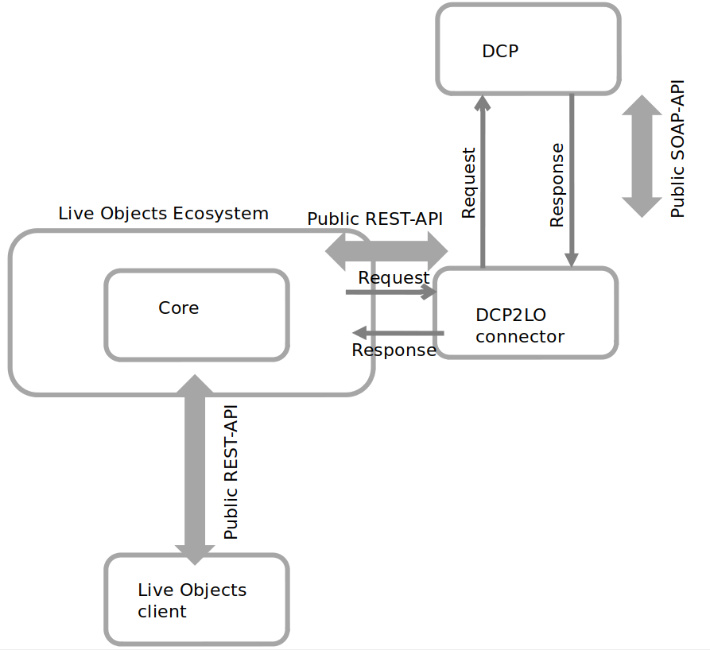
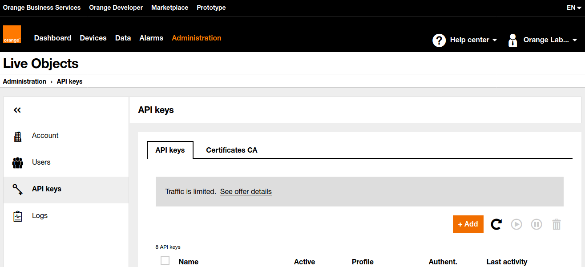
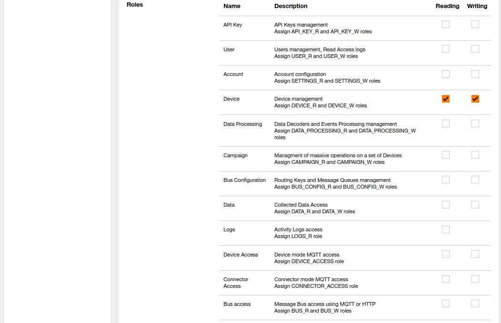

## Table of contents
* [General info](#general-info)
* [Technologies](#technologies)
* [Requirements](#requirements)
* [Building and installation](#building-and-installation)
* [Configuration](#configuration)
* [Launching](#launching)

## General info


"Ericsson Device Connection Platform to Live Objects" connector was designed to synchronize data from DCP to Live Objects. 

One connector can handle only one DCP client account (based on 'customer number') and one Live Objects account.

Every SIM card found in DCP will be transfered to LO as mqtt "Device". MSISDN number will taken as Device Id. Any other sim card properties (like imsi, status, traffic etc.) will be transfered as device properties. 

Because of LO limitation there are only 10 parameters available:
* Network country
* Network operator
* SIM ICCID
* SIM IMEI
* SIM IMSI
* SIM status
* Traffic SMS out (from last 24 hour)
* Traffic volume out (from last 24 hour)
* Traffic volume in (from last 24 hour)
* Traffic last update

## Technologies
* Java 8
* Spring Boot 2.4.4
* SOAP (jaxb)

## Requirements
In order to run the connector you need to have:
* **Live Objects account**
* **DCP account**   

## Building and installation
In order to create an installation package, run the command:
```
mvn clean package -Prelease
```
After running this command, the file  `dcp2lo-[VERSION].zip` will be created in the target directory. This file should be placed where the connector will be started, and then unpacked. You can deploy this connector wherever you want (local server, cloud provider etc.).

After unpacking the archive, you should get a structure similar to this:
```
bin/
conf/
data/
lib/
```

## Configuration

Configuration can be found in **application.yaml** file located in `conf/` directory.

```
1     server:
2       port: 8080
3       
4     spring:
5       application:
6         name: dcp2lo
7    
8     lo:
9       hostname: liveobjects.orange-business.com
10      api-key: YOUR_API_KEY
11      device-group: _YOUR_DEVICE_GROUP_NAME
12      synchronization-interval: 60000
13      synchronization-thread-pool-size: 40
14  
15    dcp:
16      customer-no: _CUSTOMER_NUMBER_
17      login: _CUSTOMEER_LOGIN_
18      password: _CUSTOMER_PASSWORD_
```
You can change all values but the most important lines are:

**2** - Tomcat port  
**9** - Live Objects hostname
**10** - Live Objects API key with at least DEVICE_R, DEVICE_W roles.
**11** - Live Objects group name
**12** - Synchronization interval in miliseconds.
**13** - Number of threads used to synchronize 
**16** - Customer number
**17** - Customer login
**18** - Customer password

#### Generate Live Objects API key
Login to Live Objects Web Portal and go to **Administration** -> **API keys**  


Click **Add** button and fill fields.
  


To  validate  the  creation  of  the  key,  click  on  the **Create** button.  Your  key  is  generated  in  the form of an alphanumeric sequence and a QR code.

#### Logging
Logging configuration can be found in **logback.xml** file located in `conf/` directory. You can find more information about how to configure your logs [here](http://logback.qos.ch/manual/configuration.html)

## Launching
In order to run the connector, use the `app.sh` file for linux or `app.bat` if you are using windows. These files are located in the `bin/` directory.